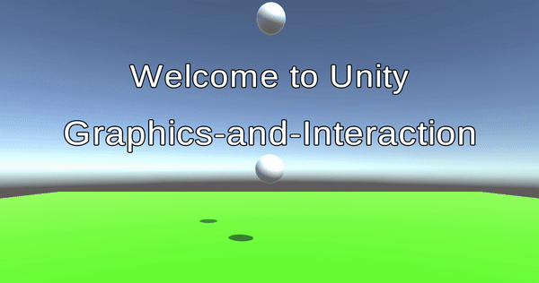
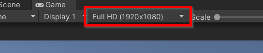
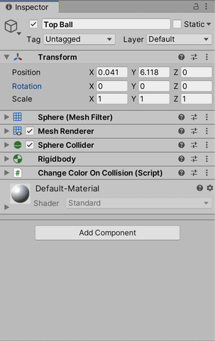
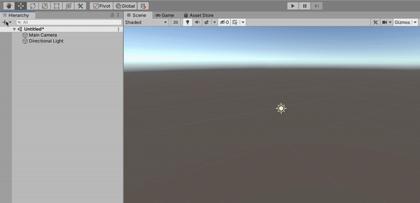

**The University of Melbourne**

# COMP30019 – Graphics and Interaction

## Workshop 1

<p align="center">
  
</p>

## Introduction

In this workshop you will be introduced to Unity, a powerful cross-platform game
engine which facilitates the construction of rich interactive scenes. You'll
also familiarise yourself with the process we'll follow for subsequent workshops -- namely,
cloning and opening a Unity project from GitHub.

The root directory of this repository is a Unity project that we've already
created for you.
After cloning the repository to your computer, you're going to open it in Unity.
This can be done easily with *Unity Hub*, which
is an application that manages Unity installations and projects on your
computer (it
should be automatically bundled with your install). Once you've launched Unity
Hub,
ensure the 'Projects' tab on the left-hand panel is currently selected. Then,
click
'Open' and navigate to the locally cloned repository. Opening it will add it to
the list of tracked projects in the same window.
Now simply click on the project to open it in Unity.

> **Note** <br>
> Opening a project in Unity for the first time can take a while, since cached library files need to
> be generated. However,
> subsequent loads of the same project should be a lot faster provided that you
> don't delete these files
(they can be found in the 'Library' folder).
> We rarely ever commit these files to a git repository as they are generally
> very large and can be re-generated locally as seen here.

Once the project is open in Unity, navigate to open `Scenes > Main` in the '
Project' panel.

At the top center of the editor window you should see a :arrow_forward: (play)
button. Click on it and the "game" will
start. You should be able to see the same sequence as the gif at the top of
this `README`. If the layout looks strange, you may need to explicitly set the resolution
in the `Game` tab to `Full HD (1920x1080)`:

<p align="center">
  
</p>

Click the play button again
to stop the game.
Make sure you understand the difference between the `Scene` tab and the `Game`
tab.
When you click the play button you are automatically switched to the game tab,
and then back to the scene tab when you click it again to stop the simulation.
Although the switch is automatic, it is possible to manually switch between
these at any point.

> **Warning** <br>
> Any changes you make to the scene while the game is running are 
> __temporary__. A common rookie trap is to manually switch to the `Scene` tab
> while the game is running, then continuing to work on the project thinking it
> will be saved (here's
> a [meme](https://www.reddit.com/r/Unity3D/comments/2xh516/when_you_realise_youve_been_making_changes_in/)
> for comic relief when it inevitably happens to you).

Now explore the scene. In the `Hierarchy` (left-hand panel) you can see all
the `GameObjects` that are part of the scene:

* **Main Camera** - The 'viewpoint' of the player.
* **Directional Light** - The main light source in the scene (simulates a 'sun'
  of sorts).
* **Top Ball and Bottom Ball** - Physics objects that collide with each other
  and change color _on collision_.
* **Plane** - Represents the 'ground' in the scene.
* **Canvas** - Defines a two-dimensional overlay serving as a 'user interface'.
    * **UI Text** - Text that is part of this overlay.
* **3D Text** - Text embedded as an actual three-dimensional object in the
  scene.

Note that not all `GameObjects` require a visual body (e.g. the camera and light
source above). Recall that `GameObjects` are composed of
one or more _components_. Aside from the default `Transform` component,
arbitrary compositions of additional components are allowed,
including an entirely 'empty' object (turns out there's a use for this!). We'll
examine components in more detail next.

## Inspector panel

Click on the **Top Ball** object, and then look at the `Inspector` (right-hand
panel)
where you can see the attached `Components`. The components
are `Sphere (Mesh Filter)`, `Mesh Renderer`, `Sphere Collider`, `Rigidbody`
and `Change Color On Collision (Script)`. To learn more
about, them click on the `?` and read the documentation from Unity. Notice how
there is no documentation page for the script. That's because this is a custom
written
C# component specific to this project (more details in the next section).

<p align="center">
  
</p>

## Scripts

We can create custom components to attach to `GameObjects` by writing C#
scripts.
The `Change Color On Collision (Script)` component is an example of this. Click
on the three dots in the top-right corner of the component, and select 'Edit
Script' from the menu which appears.
You should see the following code open up in Visual Studio (or equivalent):

```C#
using UnityEngine;

public class ChangeColorOnCollision : MonoBehaviour
{
    [SerializeField] // SerializeField exposes 'changeColorTo' in the editor.
    private Color changeColorTo = Color.white;

    private void OnCollisionEnter()
    {
        // First we'll get the material used by this game object's 'Renderer'.
        var material = GetComponent<Renderer>().material;

        // Now we can change the colour of the material.
        material.color = this.changeColorTo;
    }
}
```

The goal of this component is to change the color of an object when it collides
with another object. In particular, note the use of the private
variable `changeColorTo`. By attaching the special attribute `[SerializeField]`
to this variable,
we allow its value to be set within the
Unity interface, and also saved as part of the scene.

> **Note** <br>
> If you have used Unity before it's likely you have
> seen `public` variables used instead of `private` variables with associated
> `[SerializeField]` attributes. Both methods are valid ways to 'expose' a
> variable within the Unity editor interface. However,
> good OOP practice encourages encapsulation of object state, hence why we'll
> tend to prefer the `[SerializeField] private` approach in
> code examples. While you are encouraged to do this as well, for the purposes
> of assessment, it doesn't matter which approach you use.

If you expand the  `Change Color On Collision (Script)`
component in the Unity editor, you can see 'Change Color To' listed, and the
colour it is currently set to. Notice how the Unity editor detects not only the
variable name, but also the _type_ of that variable. In this case
there's even a special dialog box dedicated to colour picking! This is an
extremely powerful feature of the editor -- a large number of different data
types
are automatically detected out-of-the-box. As an exercise, try changing the
colour for one of
the balls, and run the game again.

<p align="center">
  
</p>

## Recreate the Scene

The best way to learn Unity is to use it. The objective for the remainder of
this class is to start with a blank scene and recreate the one you explored as
closely as possible.
This will get you accustomed to various commonly used components, as well as the
interface more generally.

Click `File > New Scene` to start from an empty scene. You should be able to
see that it comes with two `GameObjects` pre-instantiated: __Main Camera__ and 
__Directional Light__.
Add another `GameObject` by clicking the `+`, or right-clicking in the
hierarchy.

<p align="center">
  
</p>

With the help of your tutor and the original `Main` scene, make sure that
all `GameObjects` have the components required and equivalent parameters.

If you finish early try making some modifications for an extra challenge:

- Add another ball to the scene that changes to a different colour on collision.
- Change the shape of one of the balls so it is a cube instead.
- Write a script that changes the shape of the cube to a sphere on collision.

**Don't forget to save your scene periodically.**

Good Luck!

